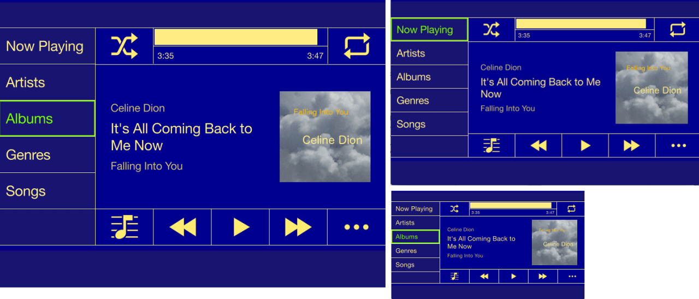

# Responsive QML HMIs with Scaling

The HMIs of in-vehicle infotainment systems, TVs, phones and many other systems must adapt to different screen resolutions and formats. This adaptation should happen with as little duplicate effort as possible. The simplest way of doing this for QML HMIs is to scale the values of all x, y, width, height, margin and border properties in proportion to a reference resolution. Based on the HMI of a music player, I’ll show you how to do this by changing only the screen width and height.

- Posted on 2015/08/29 by Burkhard Stubert [https://www.embeddeduse.com/2015/08/29/responsive-qml-hmis-with-scaling/](https://www.embeddeduse.com/2015/08/29/responsive-qml-hmis-with-scaling/)

- Copyright (C) 2015 Burkhard Stubert, Embedded Use (DBA), Germany
All rights reserved.

